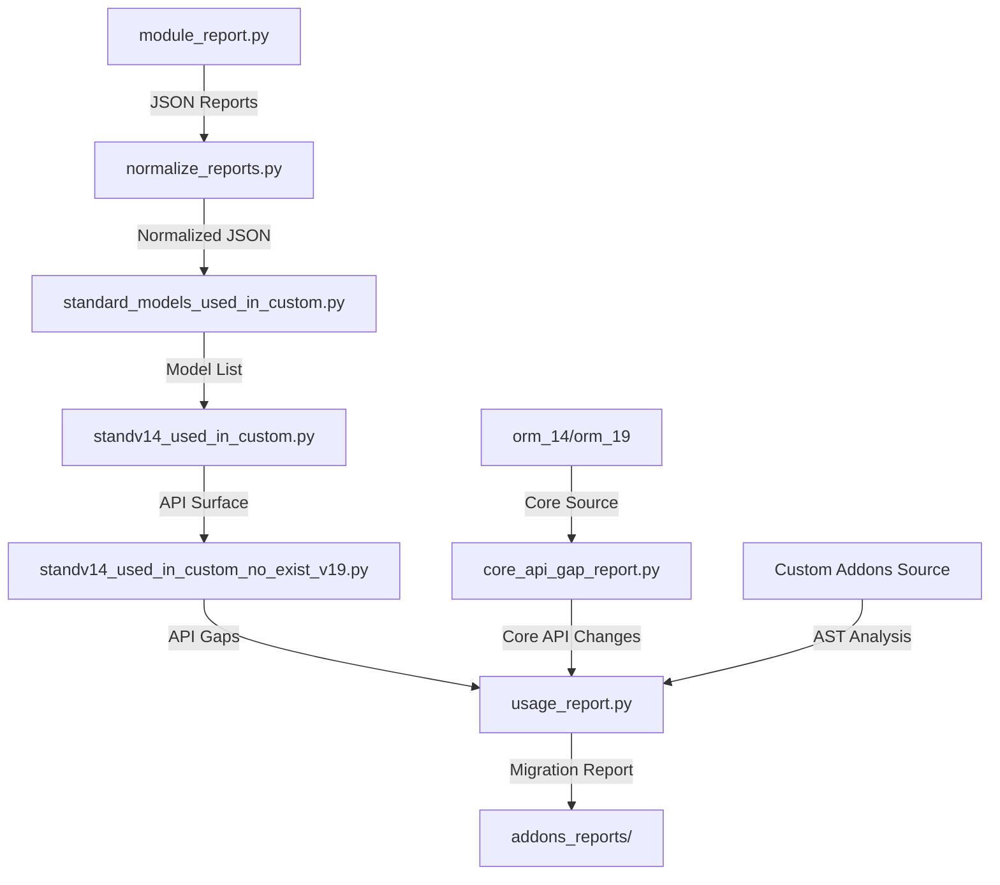

# Odoo Migration A

nalysis Pipeline Implementation

## Architecture Overview

The pipeline processes JSON reports from `module_report.py` to identify migration issues between Odoo 14 and 19. Each script has a single responsibility and processes data deterministically.




## Implementation Plan

### 1. normalize_reports.py

**Purpose**: Convert declarations_report JSON to normalized structure for deterministic diffing.**Input**: Any JSON report from `module_report.py`**Output**: Normalized JSON with structure:

```python
{
  "model_name": {
    "fields": set[str],  # All field names (including inherited)
    "methods": set[str],  # All method names (including inherited)
    "module": str,
    "inherit": list[str],  # Parent models
    "model_type": str
  }
}
```

**Key Logic**:

- Resolve inheritance chains: for each model, collect fields/methods from `_inherit` parents
- Use `model_name` as key (fallback to `class_name` if `model_name` is None)
- Convert lists to sets for deterministic comparison
- Handle Extension models (no `model_name`) by using `class_name` or first `_inherit` value

**File**: `normalize_reports.py`

### 2. standard_models_used_in_custom.py

**Purpose**: Identify which standard Odoo models are referenced in custom code.**Input**:

- Normalized `json_c` (custom addons)
- Normalized `json_s14` (Odoo 14 standard)

**Output**: List/dict of model names that exist in BOTH custom and standard:

```python
{
  "model_name": {
    "in_custom": bool,
    "in_standard": bool,
    "custom_module": str
  }
}
```

**Key Logic**:

- Match by exact `model_name`
- Also match if custom model has `_inherit` pointing to standard model
- Return intersection of models used in custom that exist in standard

**File**: `standard_models_used_in_custom.py`

### 3. standv14_used_in_custom.py

**Purpose**: Extract API surface (fields + methods) from Odoo 14 standard models used in custom code.**Input**:

- Result from step 2 (list of matching models)
- Normalized `json_s14`

**Output**: API surface dictionary:

```python
{
  "model_name": {
    "fields": set[str],
    "methods": set[str],
    "module": str
  }
}
```

**Key Logic**:

- Filter `json_s14` to only models identified in step 2
- Extract all fields and methods (already normalized)
- This defines the "potential API surface" that custom code might use

**File**: `standv14_used_in_custom.py`

### 4. standv14_used_in_custom_no_exist_v19.py

**Purpose**: Identify APIs removed between Odoo 14 and 19.**Input**:

- Result from step 3 (Odoo 14 API surface)
- Normalized `json_s19` (Odoo 19 standard)

**Output**: Gap report:

```python
{
  "model_name": {
    "removed_fields": list[str],
    "removed_methods": list[str],
    "module": str
  }
}
```

**Key Logic**:

- For each model in step 3, compare fields/methods with Odoo 19 equivalent
- If model doesn't exist in Odoo 19, mark all fields/methods as removed
- If model exists but field/method missing, add to removed list
- Sort outputs deterministically

**File**: `standv14_used_in_custom_no_exist_v19.py`

### 5. core_api_gap_report.py

**Purpose**: Extract BaseModel and core API changes from Odoo source code.**Input**:

- `orm_14/models.py` and `orm_14/fields.py`
- `orm_19/models.py` and `orm_19/fields.py`

**Output**: Core API changes:

```python
{
  "removed_methods": [
    {
      "name": str,
      "file": str,
      "line": int,
      "deprecated": bool,
      "replacement": str | None
    }
  ],
  "removed_decorators": [...],
  "removed_field_types": [...],
  "deprecated_methods": [...]
}
```

**Key Logic**:

- Parse `orm_14/models.py` and `orm_19/models.py` with AST
- Extract all methods from `BaseModel` class (and subclasses like `Model`, `TransientModel`)
- Extract decorators from `api` module (check imports)
- Extract field types from `orm_14/fields.py` and `orm_19/fields.py`
- Detect deprecation via `@api.deprecated` decorator or `warnings.warn` with "deprecated"
- Compare v14 vs v19 to find removals
- For deprecated items, extract replacement from docstring or decorator message

**File**: `core_api_gap_report.py`

### 6. usage_report.py

**Purpose**: Detect actual usage of removed/deprecated APIs in custom code.**Input**:

- Custom addons source code (`addons_folder/`)
- Result from step 4 (model API gaps)
- Result from step 5 (core API gaps)

**Output**:

- JSON: `usage_report.json`
- Markdown: `code_to_migrate.md` (optional, human-readable)

**JSON Structure**:

```python
{
  "aggregate": {
    "model_name": {
      "removed_fields": {"field_name": count},
      "removed_methods": {"method_name": count}
    }
  },
  "detailed": [
    {
      "category": "removed_field" | "removed_method" | "deprecated_api" | "core_api",
      "model": str,
      "api_name": str,
      "file_path": str,
      "line_number": int,
      "context": str  # Code snippet
    }
  ]
}
```

**Key Logic**:

- Use AST to analyze custom addon Python files
- Detect:
- Field access: `record.field_name` or `self.field_name`
- Method calls: `record.method_name()` or `self.method_name()`
- Domain usage: check for field names in domain strings
- BaseModel API calls: `self.search()`, `self.browse()`, etc.
- Decorator usage: `@api.model`, `@api.depends`, etc.
- Match against gap reports from steps 4 and 5
- Generate both aggregate counts and detailed findings
- Markdown output grouped by category → model → API

**File**: `usage_report.py`

## File Structure

```javascript
odoo-migration-scripts/
├── module_report.py (existing - DO NOT MODIFY)
├── normalize_reports.py (NEW)
├── standard_models_used_in_custom.py (NEW)
├── standv14_used_in_custom.py (NEW)
├── standv14_used_in_custom_no_exist_v19.py (NEW)
├── core_api_gap_report.py (NEW)
├── usage_report.py (NEW)
├── addons_reports/ (output directory)
├── addons_14_reports/ (input: JSON reports)
└── addons_19_reports/ (input: JSON reports)
```


## Implementation Details

### Common Patterns

1. **Type Hints**: All functions must have type hints
2. **Dataclasses**: Use `@dataclass` for structured data where appropriate
3. **Error Handling**: Graceful handling of missing files/keys
4. **Deterministic Output**: Sort dictionaries/collections for stable JSON
5. **Documentation**: Docstrings explain WHY, not just WHAT

### Inheritance Resolution

For `normalize_reports.py`, resolve inheritance by:

1. Build model dependency graph from `_inherit` relationships
2. Topologically sort models
3. For each model, merge fields/methods from parent models
4. Handle circular dependencies gracefully

### AST Analysis Patterns

For `usage_report.py`:

- Use `ast.NodeVisitor` to traverse AST
- Track context (class, method) for accurate reporting
- Extract code snippets using line numbers
- Handle both direct calls and attribute access

### Output Conventions

- JSON files: `addons_reports/` directory
- Markdown files: `addons_reports/` directory
- All outputs must be deterministic (sorted keys, stable ordering)
- Include timestamps and metadata in outputs

## Dependencies

- Standard library only: `ast`, `json`, `pathlib`, `typing`, `dataclasses`, `collections`
- No external dependencies required

## Testing Strategy

Each script should: